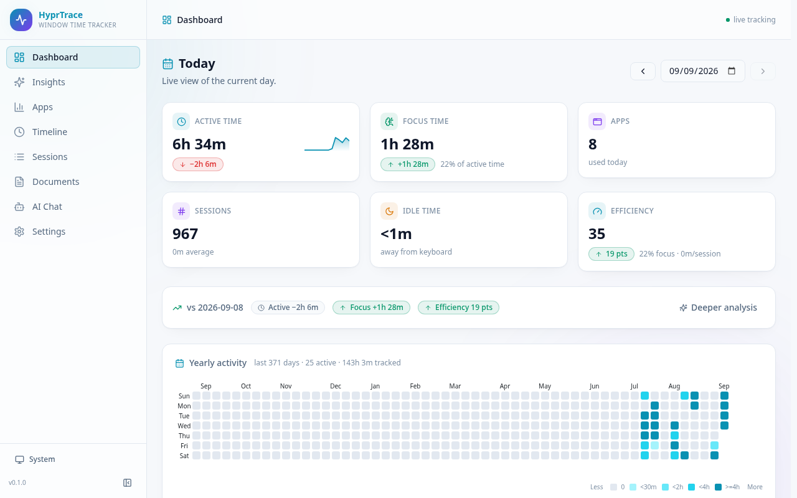
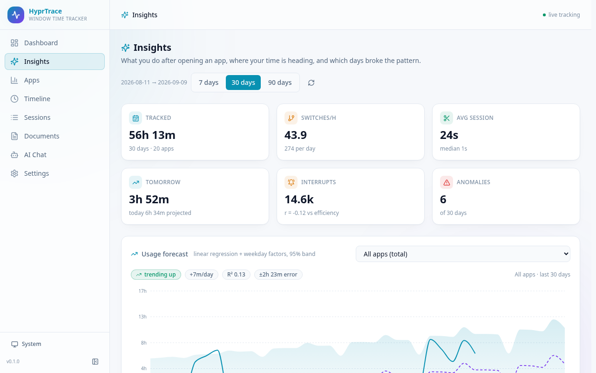
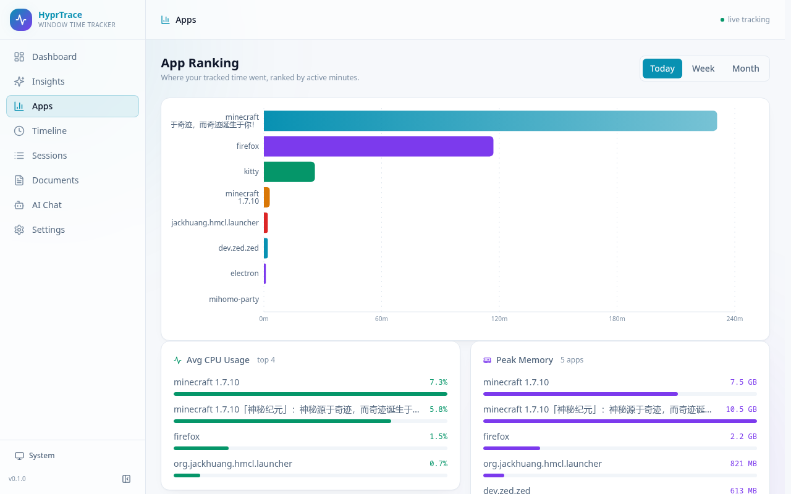
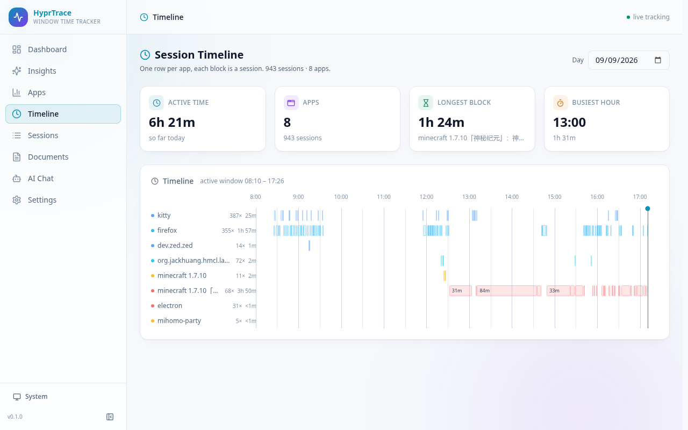
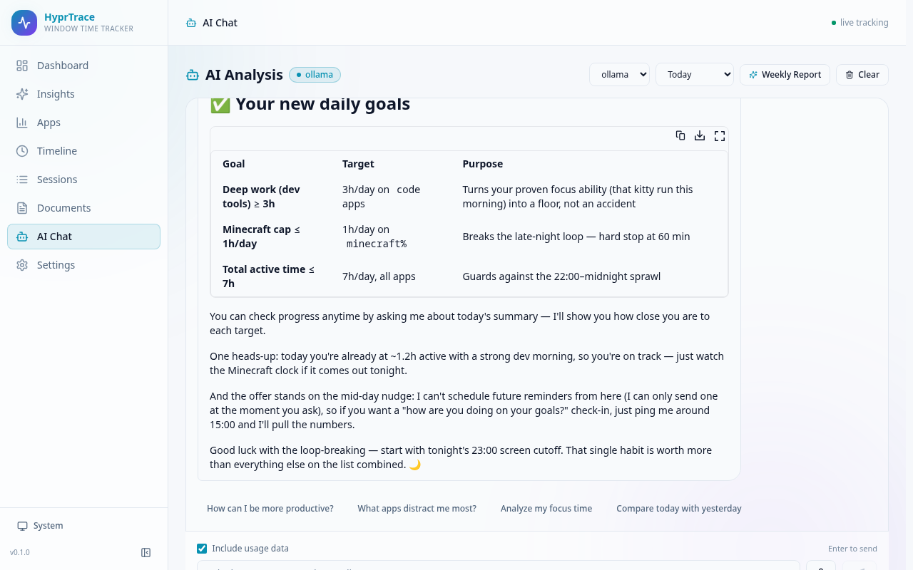
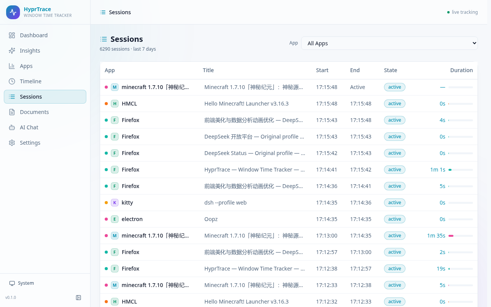

# HyprTrace

> Hyprland Window Time Tracker — 追踪你的窗口使用时间，用数据提升效率

HyprTrace 是一个 Hyprland 窗口时间追踪系统，持续记录你在每个应用上花费的时间，提供美观的 Web 仪表盘进行数据分析，并集成本地 Ollama 和云端 OpenAI 兼容 API 的 AI 分析功能。

## 预览

| Dashboard | Insights |
|---|---|
|  |  |

| Apps | Timeline |
|---|---|
|  |  |

| AI Chat | Sessions |
|---|---|
|  |  |

## 架构

```
Hyprland IPC Socket
       │
       ▼
┌──────────────────┐     ┌──────────────────┐     ┌──────────────────┐
│ hyprtrace-daemon │────▶│     SQLite       │◀────│ hyprtrace-server │
│  (Rust binary)   │     │  (WAL mode)      │     │  (Axum API)      │
│  事件监听 + 写入  │     │                  │     │  REST API + 静态文件 │
└──────────────────┘     └──────────────────┘     └────────┬─────────┘
                                                           │
                                                    ┌──────▼──────┐
                                                    │  Web 前端    │
                                                    │ React + TS  │
                                                    │ Tailwind +  │
                                                    │ Recharts    │
                                                    └─────────────┘
```

**三个组件：**

- **`hyprtrace-daemon`** — Rust 后台守护进程，监听 Hyprland 事件记录窗口焦点会话，同时运行空闲检测（loginctl + 可选的 evdev 输入监控）、资源采样、目标/作息提醒、通知与剪贴板打断采集
- **`hyprtrace-server`** — Rust Axum HTTP API 服务器，读取 SQLite 数据，暴露 REST 接口（数据查询 + AI agent 对话），提供前端静态文件服务，并运行 AI 主动监控后台任务
- **`hyprtrace-web`** — React + TypeScript + Tailwind CSS + Recharts + framer-motion 前端 SPA，包含仪表盘、洞察分析、应用排行、时间线、会话浏览、目标管理和 AI 分析面板，支持深色/浅色/跟随系统主题

## 功能

- **自动追踪** — 守护进程自动记录每个窗口的使用时长、窗口 PID、CPU/内存占用，无需手动操作
- **仪表盘** — 今日活跃时间、应用数量、会话数量、空闲时间一览，含效率评分卡片
- **效率评分** — 基于聚焦占比、会话碎片化、深夜使用和打断次数计算 0-100 分的每日效率分
- **应用分类** — 通过 class/标题正则规则将应用归类为开发、娱乐、社交等，规则可在设置页自定义
- **资源监控** — 每 30 秒采样当前窗口进程的 CPU 和内存占用，按应用聚合展示
- **应用排行** — 按日/周/月查看各应用使用时长排名，支持点击查看趋势图
- **动态时间线** — 甘特图按应用展示当天会话时间块，横轴自动聚焦活跃时段
- **年度活动热力图** — GitHub 贡献图风格的近一年每日活跃时间日历热力图，直观呈现长期使用习惯
- **文档/标题追踪** — 按窗口标题（具体文件、标签页、网页）聚合时间，回答"具体在做什么"，可在设置中关闭标题记录以保护隐私
- **打断监控** — 通过 D-Bus 捕获桌面通知、轮询剪贴板，量化一天中的干扰次数
- **每日目标** — 设定每日活跃时长目标，达到 50%/100% 时桌面通知提醒，并支持连续聚焦休息提醒
- **趋势预测** — 基于历史数据线性回归预测今日和明日使用量
- **洞察分析（Insights）** — 独立的深度分析页，包含以下 7 类分析：
  - **应用转移概率** — 马尔可夫转移矩阵 + 流向图，回答"打开 A 之后下一个最可能打开什么"，可调节会话时长阈值过滤抖动
  - **使用时长回归预测** — 最小二乘趋势 + 周内效应 + 95% 置信区间，支持按应用查看今日/明日预测与拟合优度（R²、MAE）
  - **周 × 小时作息热力图** — 按星期与小时聚合的平均使用强度，一眼看出作息规律与深夜时段
  - **焦点与上下文切换** — 平均会话时长、每小时切换次数、一分钟内会话占比、估算的重建上下文成本
  - **应用共现分析** — 30 分钟窗口内一起使用的应用对，用 lift 判断是否高于随机
  - **打断与效率关联** — 每日打断数与效率分的相关性、最安静与最嘈杂 25% 日子的对比
  - **异常日检测** — 基于中位数 + MAD 的稳健基线，标出偏离日常习惯的日子及原因
- **主题与动效** — 深色/浅色/跟随系统三种主题（CSS 变量驱动，切换无需刷新），页面切换、卡片入场、数字滚动、图表绘制等动画均遵循 `prefers-reduced-motion`
- **周报导出** — 一键导出 Markdown 格式周报，或让 AI 生成带洞察的分析报告
- **AI 分析** — 集成 Ollama 本地模型和 OpenAI 兼容 API，AI agent 可实时查询 Hyprland 状态与历史数据
- **AI 主动监控** — 后台任务定时分析使用模式，发现异常（熬夜、游戏超时、目标告急）时主动推送建议
- **语音输入** — AI 聊天支持 Web Speech API 语音转文字
- **Waybar 模块** — 状态栏实时显示当前应用、会话时长和当日目标进度
- **工作区建议** — 分析历史会话，推荐每个应用应归属的工作区
- **作息提醒** — 深夜活跃时推送休息提醒，可选配置 Hyprlock 强制锁定
- **数据导出** — 支持导出 CSV 格式的会话数据
- **Web 配置** — 在设置页面直接配置 AI API、分类规则和每日目标，无需编辑配置文件

## 安装

### 依赖

- [Rust 工具链](https://rustup.rs/) (cargo)
- [Node.js](https://nodejs.org/) + npm
- [Hyprland](https://hyprland.org/) Wayland 合成器

### 一键安装

```bash
git clone https://github.com/yourusername/hyprtrace.git
cd hyprtrace
bash scripts/install.sh
```

安装脚本会：
1. 编译 Rust 后端 (`hyprtrace-daemon` + `hyprtrace-server`)
2. 构建前端并复制到 `~/.local/share/hyprtrace/web/`
3. 安装并启动 systemd 用户服务

> **可选：键盘/鼠标活动检测**（`enable_input_monitor = true`）需要读取 `/dev/input/event*`，用户需加入 `input` 组：`sudo usermod -aG input $USER`（然后重新登录）。启用并成功打开输入设备后，**idle 判定以“一段时间没有物理键鼠输入”为准**（`idle_timeout_seconds`）；loginctl 和 Hyprland 事件仅作为回退信号。未配置或权限不足时守护进程会优雅降级并提示。

### 卸载

```bash
bash scripts/uninstall.sh           # 移除程序文件和服务
bash scripts/uninstall.sh --data    # 同时删除数据库
bash scripts/uninstall.sh --config  # 同时删除配置文件
bash scripts/uninstall.sh --all     # 删除所有文件（程序 + 数据 + 配置）
```

## 使用

安装完成后：

- **Web 仪表盘**: 打开浏览器访问 `http://localhost:9420`
- **数据库**: `~/.local/share/hyprtrace/hyprtrace.db`
- **配置文件**: `~/.config/hyprtrace/config.toml`

### 手动启动

```bash
# 启动守护进程（需要 Hyprland 运行中）
hyprtrace-daemon

# 启动 API 服务器
hyprtrace-server

# 开发模式前端（带热更新，代理 API 到 9420）
cd web && npm run dev
```

### Waybar 状态栏模块

在 `~/.config/waybar/config.jsonc` 中添加：

```jsonc
"custom/hyprtrace": {
  "exec": "~/.local/bin/waybar-hyprtrace.sh",
  "interval": 60,
  "return-type": "json",
  "format": "{}"
}
```

需要先将脚本复制到 `~/.local/bin/`（或直接引用 `scripts/waybar-hyprtrace.sh` 的路径）。脚本依赖 `curl` 和 `python3`，实时显示当前应用、会话时长与当日目标进度。

## 配置

配置文件位于 `~/.config/hyprtrace/config.toml`，首次运行自动生成：

```toml
[daemon]
db_path = "~/.local/share/hyprtrace/hyprtrace.db"
idle_timeout_seconds = 300
focused_threshold_seconds = 1200        # 连续使用多久视为"聚焦"（默认 20 分钟）
enable_input_monitor = true             # evdev 键盘/鼠标活动检测（启用后 idle 以键鼠无输入为准，需 input 组权限）
record_titles = true                    # 是否记录窗口标题（关闭后仅记录应用 class，重启守护进程后生效）
break_after_minutes = 90                # 连续聚焦多久提醒休息
late_night_start_hour = 23              # 深夜提醒窗口起点（本地时区）
late_night_end_hour = 6                 # 深夜提醒窗口终点
hyprlock_command = ""                   # 可选：深夜强制锁定命令（如 "hyprlock"，空格分隔参数，不经过 shell 执行）

[server]
host = "127.0.0.1"
port = 9420
auth_token = ""                         # 可选：API 访问令牌。留空则仅需本机访问；若绑定局域网地址（0.0.0.0 等）请务必设置

[ai]
default_provider = "ollama"
proactive_interval_minutes = 120        # AI 主动监控间隔

[ai.ollama]
base_url = "http://localhost:11434"
default_model = "qwen2.5:7b"

[ai.openai]
api_key = ""
base_url = "https://api.openai.com/v1"
default_model = "gpt-4o-mini"
```

也可以在 Web 设置页面直接修改配置，无需手动编辑文件。除配置文件外，每日目标可以在设置页的 **Daily Goals** 区管理，应用分类规则在 **App Categories** 区管理。

## AI 集成

AI 聊天采用 **agent 模式**：模型可以通过工具实时查询 Hyprland 状态（活动窗口、工作区、监视器、输入设备等）和历史使用数据（汇总、排行、会话、小时分布等），支持多轮工具调用，并可将分析结果写成每日目标或发送桌面提醒。

### Ollama（本地）

```bash
# 安装 Ollama 并拉取模型
ollama pull qwen2.5:7b
```

### OpenAI / 兼容 API

支持所有 OpenAI 兼容 API，例如：

- **OpenAI**: `https://api.openai.com/v1`
- **DeepSeek**: `https://api.deepseek.com/v1`
- **Groq**: `https://api.groq.com/openai/v1`
- **本地代理**: `http://localhost:8080/v1`

在 Web 设置页面填入 API 地址、密钥和模型名称即可。AI 页面支持语音输入、模型/供应商下拉选择（选择会记忆），并有一键生成 AI 周报和主动监控提醒功能。

## 开发

```bash
# Rust 后端
cargo build --release
cargo check -p hyprtrace-daemon
cargo check -p hyprtrace-server

# 前端
cd web
npm install
npm run dev        # 开发服务器 (localhost:5173)
npm run build      # 生产构建
```

开发时若要指向另一台实例（例如用数据库副本起的临时服务），设置 `VITE_API_TARGET`：

```bash
VITE_API_TARGET=http://127.0.0.1:9421 npm run dev
```

### 洞察分析 API

`/api/insights/*` 为只读分析接口，前端洞察页直接调用：

| 端点 | 说明 |
|---|---|
| `/api/insights/transitions` | 应用转移概率矩阵、流向边、自转移概率 |
| `/api/insights/forecast` | 单应用或总体时长的回归预测（含置信区间与周内因子） |
| `/api/insights/rhythm` | 星期 × 小时的平均使用强度 |
| `/api/insights/fragmentation` | 会话碎片化与上下文切换成本 |
| `/api/insights/cooccurrence` | 应用共现对（lift / jaccard / 支持度） |
| `/api/insights/disruption-impact` | 打断与效率的相关性分析 |
| `/api/insights/anomalies` | 稳健基线下的异常日检测 |

前端设计系统（颜色 token、组件类、动效约定）见 [`web/DESIGN.md`](web/DESIGN.md)。

## CI

GitHub Actions 在每次 push / pull request 时运行 `cargo check`、`cargo test` 与 `npm run build`。

## 技术栈

| 组件 | 技术 |
|---|---|
| 守护进程 | Rust, hyprland-rs, rusqlite, evdev, dbus-monitor |
| API 服务器 | Rust, Axum, tokio, reqwest |
| 前端 | React 18, TypeScript, Vite, Tailwind CSS 3, Recharts, framer-motion, Lucide Icons |
| AI 前端 | @ai-sdk/react, streamdown, Web Speech API |
| 数据库 | SQLite (WAL mode) |
| AI 后端 | Ollama (本地 NDJSON 流), OpenAI 兼容 API (云端 SSE 流), agent 工具调用 |

## License

MIT
