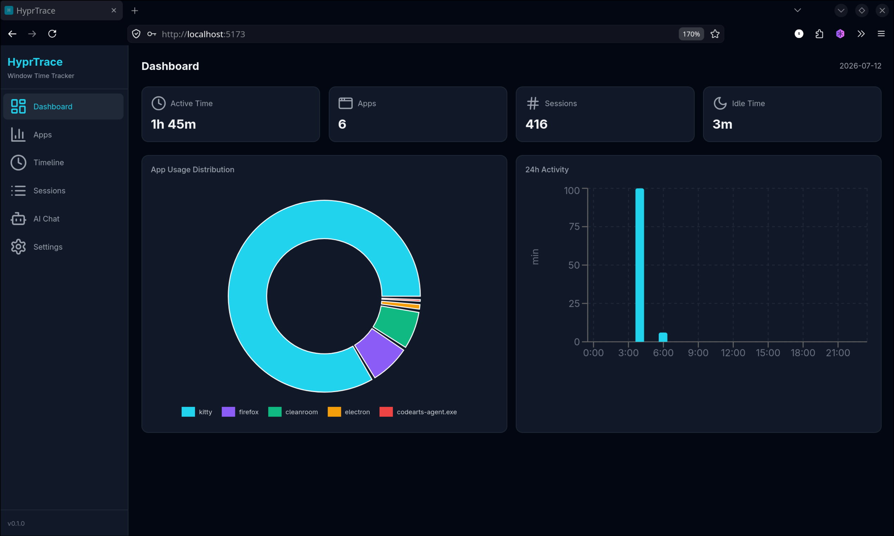
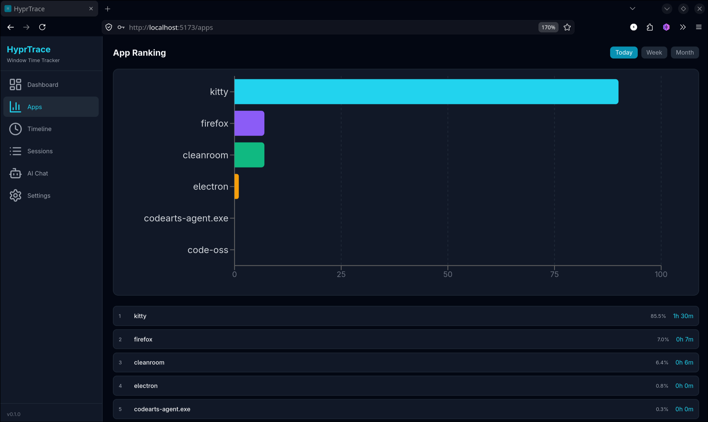
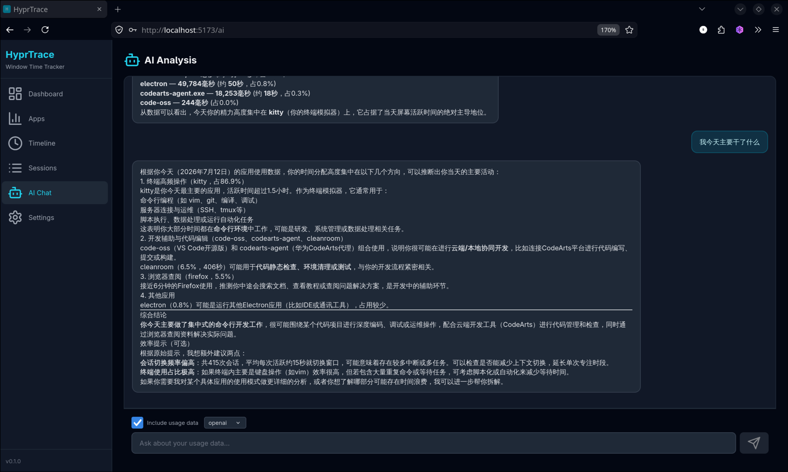
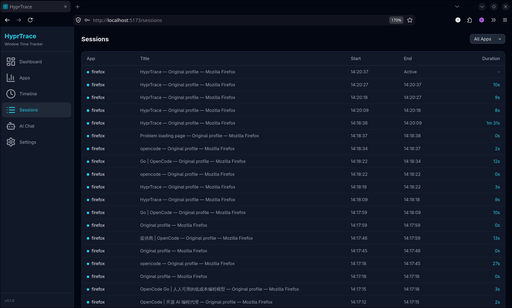

## 1. 作品信息总览

### 1.1 作品名称

HyprTrace — Hyprland Window Time Tracker

### 1.2 作品简介

HyprTrace 是一个专为 Hyprland Wayland 合成器设计的窗口时间追踪系统。它以后台守护进程形式持续监听 Hyprland IPC 事件，自动记录每个窗口的焦点切换和活跃时长，将数据持久化到 SQLite 数据库。用户可通过美观的 Web 仪表盘直观地查看当天活跃时间分布、应用使用排名、24 小时时间线和详细会话记录。系统还集成了 AI 分析功能，支持本地 Ollama 模型和 OpenAI 兼容 API，能够对用户的使用效率进行分析并给出建议。该项目完全使用 Rust 构建后端，保证高性能和低资源占用，前端采用 React + TypeScript + Tailwind CSS 技术栈。

## 2. 介绍 & 项目规划

### 2.1 项目规划

**整体目标：**
构建一套完整的 Hyprland 窗口时间追踪与分析系统，覆盖从数据采集、存储、可视化到 AI 智能分析的全链路。

**各模块分工：**

| 模块 | 职责 | 技术选型 |
|------|------|----------|
| hyprtrace-daemon | 监听 Hyprland IPC 事件，管理窗口焦点会话，写入 SQLite | Rust, hyprland-rs, rusqlite |
| hyprtrace-server | 提供 REST API 数据查询接口，AI 对话代理，托管前端静态文件 | Rust, Axum, tokio, reqwest |
| hyprtrace-web | 数据可视化仪表盘，用户交互界面，AI 对话面板 | React 18, TypeScript, Vite, Tailwind CSS, Recharts |

**阶段规划：**
- **第一阶段** — 搭建 Rust workspace 结构，实现 daemon 的事件监听和数据写入，server 的基本路由框架
- **第二阶段** — 实现前端仪表盘核心页面（Dashboard、Apps、Timeline、Sessions）
- **第三阶段** — 集成 AI 分析模块（Ollama + OpenAI 兼容 API），添加 AI 对话页面
- **第四阶段** — 完善配置管理、安装卸载脚本、系统通知集成、错误处理与用户体验优化

**风险规避：**
- hyprland-rs 为 beta 版本，通过将其隔离在 daemon crate 中降低对 server 的影响
- SQLite 使用 WAL 模式避免 daemon 写入与 server 读取的锁冲突
- AI 模块抽象为 trait，支持插件式切换，单个提供商故障不影响整体

## 3. 业务介绍

**项目背景：**
在 Hyprland 等平铺式窗口管理器上，用户通常会同时打开大量窗口和 workspace，缺乏对时间分配和使用习惯的直观感知。HyprTrace 旨在帮助用户了解自己的应用使用模式，识别效率瓶颈，从而优化工作流。

**作品主要特点：**
- **自动无感采集** — 后台守护进程全自动运行，无需用户手动打卡或记录
- **实时美观可视化** — 基于 Recharts 的响应式图表，包括饼图、柱状图、折线图、热力图
- **多维度分析** — 支持按天/周/月查看应用排名、24 小时活动分布、单应用趋势
- **AI 智能分析** — 支持本地 Ollama 和云端 OpenAI 兼容 API，提供个性化效率建议
- **隐私优先** — 所有数据本地存储，AI 分析可配置，API 密钥 Web 端直接配置

**功能模块：**
- 数据采集模块（daemon）：Hyprland IPC 事件监听 → 会话管理 → SQLite 写入
- 数据服务模块（server）：REST API 查询 → 数据聚合 → AI 对话代理
- 前端可视化（web）：Dashboard / Apps / Timeline / Sessions / AI Chat / Settings

**业务架构：**
```
Hyprland IPC Socket → hyprtrace-daemon → SQLite (WAL) ← hyprtrace-server ← Web 前端
                                            ↓
                                      AI 分析 (Ollama / OpenAI)
```

## 4. 技术架构

**项目使用技术组成：**

| 层级 | 技术 | 用途 |
|------|------|------|
| 运行时 | Rust 2021 edition, tokio | 异步运行时，系统级性能 |
| 事件监听 | hyprland-rs 0.4.0-beta.3 | Hyprland IPC 协议客户端 |
| 数据库 | SQLite via rusqlite (bundled) | 单文件存储，WAL 模式 |
| Web 框架 | Axum 0.7 | 异步 HTTP 路由，类型安全 |
| HTTP 客户端 | reqwest 0.12 | AI API 调用 |
| 前端框架 | React 18 + TypeScript | SPA 用户界面 |
| 构建工具 | Vite 5 | 快速 HMR 开发体验 |
| CSS | Tailwind CSS 3 | 响应式暗色主题 |
| 图表 | Recharts 2 | 数据可视化 |
| 图标 | Lucide React | 轻量级 SVG 图标 |
| AI | Ollama / OpenAI 兼容 API | 本地 + 云端双模式 |
| 部署 | systemd user services | 开机自启，异常自动重启 |

**交互逻辑：**
1. daemon 通过 Unix socket 连接 Hyprland IPC，订阅 `ActiveWindowChanged` 事件
2. 每次窗口切换时，daemon 结束上一会话（计算时长）、开启新会话（记录 class/title/workspace）
3. 同时更新 daily_summary 表，按天+应用聚合统计数据
4. server 通过 SQLite WAL 模式并发读取数据，暴露 RESTful JSON API
5. 前端通过 fetch 调用 API，使用 Recharts 渲染各图表
6. AI Chat 功能中，server 从数据库获取使用数据上下文，拼接 system prompt 后调用 AI 模型

## 5. 功能介绍

**核心模块：**

| 模块 | 功能 | 亮点 |
|------|------|------|
| Dashboard | 今日活跃时间、应用数、会话数、空闲时间统计 + 应用分布饼图 + 24h 热力图 | 四张统计卡片一览全局，实时展示当日数据 |
| Apps | 应用使用时长排名（日/周/月）+ 单应用趋势折线图 | 点击应用可展开 30 天趋势，支持 3 种时间粒度 |
| Timeline | 24 小时活动柱状图，显示每小时活跃分钟数 | 按时间顺序展示全天活动，直观查看高峰时段 |
| Sessions | 分页浏览所有窗口切换历史，按应用筛选 | 支持分页和筛选，显示每个会话的起止时间和时长 |
| AI Chat | AI 分析对话，支持 Ollama + OpenAI 兼容 API | 可选包含使用数据上下文，快捷提问，模型列表自动发现 |
| Settings | 服务器状态、AI 配置（URL + Key + Model）、CSV 导出 | Web 端直接修改 AI 配置并热加载，一键导出会话数据 |

**功能亮点：**
- 暗色主题 + 自定义 Hypr 配色方案（青色主色调），符合 Hyprland 社区审美
- 守护进程优雅关闭：收到 SIGTERM/SIGINT 时自动结束当前活动会话再退出
- AI 配置热加载：通过 Web 设置页修改 API 地址和密钥后即时生效，无需重启服务
- 双 AI 提供商：Ollama 本地推理保证隐私，OpenAI 兼容 API 提供更强模型能力（支持 DeepSeek、Groq 等）

**设计亮点：**
- Rust workspace 架构，daemon 和 server 独立二进制部署
- SQLite WAL 模式 + busy_timeout 确保并发读写安全
- 前端 Error Boundary 兜底，防止白屏
- 异常响应式布局，适配不同屏幕尺寸
- TOML 配置文件自动生成，零配置启动

## 6. 成果展示

**项目仓库：** https://github.com/fulatin/hyprtrace

**实际运行截图：**

| Dashboard 仪表盘 | Apps 应用排行 |
|---|---|
|  |  |

| AI Chat 分析 | Sessions 会话记录 |
|---|---|
|  |  |

**技术指标：**
- 项目总代码量：~12500 行
- Rust 后端：~1200 行（daemon 约 470 行，server 约 730 行）
- TypeScript 前端：~1600 行
- 编译产物：daemon ~3.1MB，server ~5.8MB（release 优化）
- 运行时内存占用：daemon < 5MB，server < 15MB
- 数据库单文件，WAL 模式，支持长时间运行
